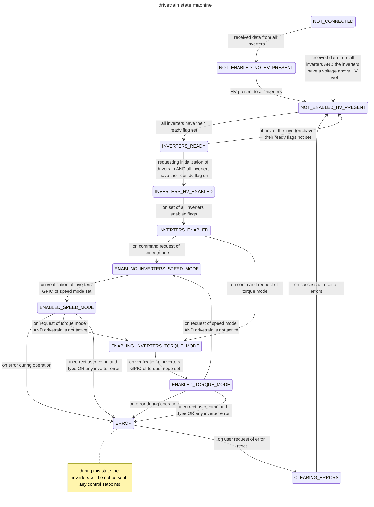

## Drivetrain System (tentative design docs)

### interface / usage description

the user of the drivetrain system will be expected to use the `evaluate_drivetrain` function to interact / command and receive the current status of the drivetrain. 

#### initialization
the user shall call the `evaluate_drivetrain` function with the cmdvariant type set to the initialization struct and populated with desired mode to put the drivetrain into. the user should continuously call the `evaluate_drivetrain` with this struct until the drivetrain's state reaches the initialization state expected.

#### drivetrain commanding

once initialized, the user is able to command the drivetrain with either speed or torque commands. 

The user may switch between command modes so long as the drivetrain is not active / the car is not driving (all inverter RPMs < 100). this is purely for safety, however this needs to be tested for the exact requirements to switch between control modes during runtime.

### state machine description

Instead of the drivetrain system being a direct api interface on top of the inverter interface with calls to the drivetrain system that call the lower-level inverter interface immediately to queue CAN messages, the drivetrain system will instead update pieces of the inverter interface's internal state (such as bit flags) for it to send periodically.

This is being done to simplify the interaction between the inverters and the rest of our firmware and to resolve the CAN saturation issues that were occuring with the last drivetrain system / inverter interface issues that were hackily solved with a metro timer dictating when the queue of CAN messages that were being sent out from the inverter could be appended to.

