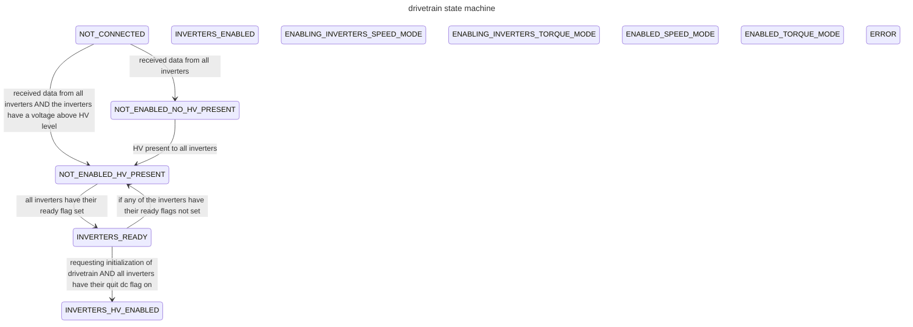

```mermaid
---
title: drivetrain state machine
---
stateDiagram-v2

    nc : NOT_CONNECTED 
    not_en : NOT_ENABLED_NO_HV_PRESENT
    not_en_hv : NOT_ENABLED_HV_PRESENT
    ready : INVERTERS_READY 
    hv_en : INVERTERS_HV_ENABLED
    en : INVERTERS_ENABLED
    en_sp_mode : ENABLING_INVERTERS_SPEED_MODE
    en_torq_mode : ENABLING_INVERTERS_TORQUE_MODE
    speed_mode : ENABLED_SPEED_MODE
    torq_mode : ENABLED_TORQUE_MODE
    err: ERROR

    nc --> not_en: received data from all inverters
    nc --> not_en_hv: received data from all inverters AND the inverters have a voltage above HV level
    not_en --> not_en_hv: HV present to all inverters
    not_en_hv --> ready: all inverters have their ready flag set
    ready --> hv_en: requesting initialization of drivetrain AND all inverters have their quit dc flag on
    ready --> not_en_hv: if any of the inverters have their ready flags not set
    
```